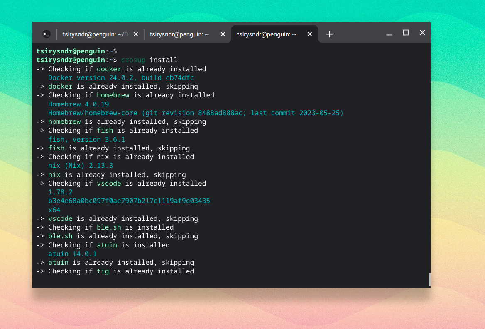

# Crosup 🐧 💻 🚀 ✨

<p>
  <a href="LICENSE" target="./LICENSE">
    
  </a>
  <a href="https://crates.io/crates/crosup" target="_blank">
    
  </a>
  
  <a href="https://crates.io/crates/crosup" target="_blank">
    
  </a>

  <a href="https://github.com/tsirysndr/crosup/actions/workflows/release.yml" target="_blank">
    
  </a>
</p>



Crosup is a CLI tool to help you quickly setup your development environment on a new Chromebook (ChromeOS) or any Linux distribution. It is designed to be simple and easy to use.

## ✨ Features
- [x] Compatible with ChromeOS, Debian-based Linux, OpenSUSE, Fedora, RedHat, CentOS, Alpine and more!
- [x] Detects your OS and installs the appropriate tools
- [x] HCL/TOML configuration file
- [x] Installs developer tools like docker, nix, devbox, homebrew, flox, fish, vscode, ble.sh, atuin, tig, fzf, httpie, kubectl, minikube, tilt, zellij, ripgrep, fd, exa, bat, glow, devenv and more!
  
## 🚚 Installation
```sh
bash <(curl -sSL https://raw.githubusercontent.com/tsirysndr/crosup/master/install.sh)
```

## 📦 Supported OS
- [x] ChromeOS (Debian Container)
- [x] Debian-based Linux
- [x] OpenSUSE
- [x] Fedora
- [x] RedHat
- [x] CentOS
- [x] Alpine
- [x] Arch
- [x] Gentoo
- [x] Slackware

## 🚀 Usage
```
             ______                __  __
            / ____/________  _____/ / / /___
           / /   / ___/ __ \/ ___/ / / / __ \
          / /___/ /  / /_/ (__  ) /_/ / /_/ /
          \____/_/   \____/____/\____/ .___/
                                    /_/

Quickly install your development tools on your new Chromebook or any Linux distribution

USAGE:
    crosup [SUBCOMMAND]

OPTIONS:
    -h, --help       Print help information
    -V, --version    Print version information

SUBCOMMANDS:
    add        Add a new tool to the configuration file
    diff       Show the difference between the current configuration and the previous one
    help       Print this message or the help of the given subcommand(s)
    history    Show the change history of the configuration file
    init       Generate a default configuration file
    install    Install developer tools, e.g. docker, nix, devbox, homebrew, fish, vscode, ble.sh
                   ...
    search     Search for a package in the nixpkgs repository
```

## 🛠️ Minimal Configuration
This is a minimal configuration file to install vim and git:

```toml
# Crosfile.toml
packages = [
  "vim",
  "git"
]
```

When you run `crosup install`, it will detect your OS and install the appropriate tools using nix [home-manager](https://nix-community.github.io/home-manager/) on your system.

## 📝 Advanced Configuration
Crosup uses a configuration file to determine which tools to install. The default configuration is embedded in the binary, but you can generate a default configuration file (Crosfile.hcl) using the `crosup init` subcommand, you can specify the default format using the `--toml` flag.

Example of a Crosfile.toml (`crosup init --toml`) for a Debian-based system:

```toml
# Crosfile.toml
[brew.install.pkg.neovim]
version_check = "nvim --version"

[git.install.repo.blesh]
url = "https://github.com/akinomyoga/ble.sh.git"
install = "make -C ble.sh install PREFIX=~/.local"
preinstall = "sudo apt-get install -y gawk build-essential"
postinstall = "echo 'source ~/.local/share/blesh/ble.sh' >> ~/.bashrc"
install_check = "~/.local/share/blesh/ble.sh"
recursive = true
depth = 1
shallow_submodules = true

[nix.install.pkg.flox]
impure = true
experimental_features = "nix-command flakes"
accept_flake_config = true
preinstall = "echo 'extra-trusted-substituters = https://cache.floxdev.com' | sudo tee -a /etc/nix/nix.conf && echo 'extra-trusted-public-keys = flox-store-public-0:8c/B+kjIaQ+BloCmNkRUKwaVPFWkriSAd0JJvuDu4F0=' | sudo tee -a /etc/nix/nix.conf"
flake = "github:flox/floxpkgs#flox.fromCatalog"
version_check = ". /nix/var/nix/profiles/default/etc/profile.d/nix-daemon.sh && flox --version"

[nix.install.pkg.cachix]
flake = "github:cachix/cachix"

[nix.install.pkg.devenv]
accept_flake_config = true
preinstall = """
echo \"trusted-users = root $USER\" | sudo tee -a /etc/nix/nix.conf
sudo pkill nix-daemon
cachix use devenv"""
flake = "github:cachix/devenv/latest"
depends_on = ["cachix"]
version_check = ". /nix/var/nix/profiles/default/etc/profile.d/nix-daemon.sh && devenv version"

[curl.install.script.devbox]
url = "https://get.jetpack.io/devbox"
version_check = "devbox version"
shell = "bash"
depends_on = ["nix"]

[curl.install.script.devbox.env]
FORCE = "1"

[curl.install.script.atuin]
url = "https://raw.githubusercontent.com/ellie/atuin/main/install.sh"
version_check = "atuin --version"
shell = "bash"

[curl.install.script.nix]
url = "https://install.determinate.systems/nix"
enable_sudo = true
version_check = ". /nix/var/nix/profiles/default/etc/profile.d/nix-daemon.sh && nix --version"
args = "install --no-confirm"

[curl.install.script.homebrew]
url = "https://raw.githubusercontent.com/Homebrew/install/HEAD/install.sh"
postinstall = "echo 'eval $(/home/linuxbrew/.linuxbrew/bin/brew shellenv)' >> ~/.bashrc"
version_check = "brew --version"
shell = "bash"

[curl.install.script.homebrew.env]
NONINTERACTIVE = "true"

[apt.install.pkg.docker]
gpg_key = "https://download.docker.com/linux/debian/gpg"
gpg_path = "/etc/apt/keyrings/docker.gpg"
setup_repository = "echo \"deb [arch=\"$(dpkg --print-architecture)\" signed-by=/etc/apt/keyrings/docker.gpg] https://download.docker.com/linux/debian \"$(. /etc/os-release && echo \"$VERSION_CODENAME\")\" stable\" | sudo tee /etc/apt/sources.list.d/docker.list > /dev/null"
apt_update = true
packages = [
    "docker-ce",
    "docker-ce-cli",
    "containerd.io",
    "docker-buildx-plugin",
    "docker-compose-plugin",
]
depends_on = [
    "ca-certificates",
    "curl",
    "gnupg",
]
postinstall = "sudo usermod -aG docker $USER && newgrp docker"
version_check = "docker --version"

[apt.install.pkg.vscode]
url = "https://code.visualstudio.com/sha/download?build=stable&os=linux-deb-x64"
version_check = "code --version"

```

## 🚀 As a GitHub Action

You can use crosup as a GitHub Action to install developer tools on your CI/CD pipeline.


```yaml
name: Setup Crosup
on:
  push:
    branches:
      - master
  pull_request:
    branches:
      - master
  workflow_dispatch:

jobs:
  setup-crosup:
    runs-on: ubuntu-latest
    continue-on-error: true
    steps:
      - name: Install Nix
        uses: DeterminateSystems/nix-installer-action@v4
      - name: Setup Crosup
        uses: tsirysndr/setup-crosup@v1
        with:
          version: 'v0.4.10'
          # Add packages to install here
          packages: |
            deno
            zig
      - name: Verify Crosup
        run: crosup --version
      - name: Verify Deno
        run: deno --version
      - name: Verify Zig
        run: zig version
```

See [action.yml](https://github.com/tsirysndr/setup-crosup/blob/master/action.yml) for the full documentation for this action's inputs and outputs.

## 🤝 Contributing
Contributions, issues and feature requests are welcome!
See [CONTRIBUTING](./CONTRIBUTING.md) for more information.

## 📝 License
[MIT](./LICENSE)
